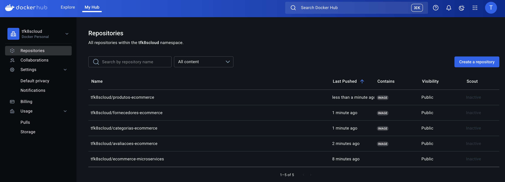

# E-COMMERCE MICROSERVICES

Sistema de e-commerce baseado em microserviços para gerenciamento de produtos, categorias, fornecedores e avaliações.

## Arquitetura de Microserviços


O projeto é composto por quatro microserviços independentes que se comunicam entre si:

1. **Microserviço de Produtos**: Gerencia o catálogo de produtos, incluindo detalhes, preços e estoque
2. **Microserviço de Categorias**: Gerencia a hierarquia de categorias e seus atributos
3. **Microserviço de Fornecedores**: Gerencia fornecedores, contatos e entregas
4. **Microserviço de Avaliações**: Gerencia avaliações de produtos e seus resumos

## Tecnologias Utilizadas

- **Backend**: Python 3.10 com Flask
- **Containerização**: Docker
- **Comunicação**: REST APIs

## Requisitos

- Python 3.10+
- Docker e Docker Compose
- Git

## Estrutura do Projeto

```
E-COMMERCE-MICROSERVICES/
├─ assets/
├── projetos/
│   ├── imagens/
│   │   ├── microservices.png
│   ├─ microservices.xml

├─ projetos/
├── ecommerce/
│   ├── avaliacoes-service/
│   │   ├── app.py
│   │   ├── Dockerfile
│   │   └── requirements.txt
│   ├── categorias-service/
│   │   ├── app.py
│   │   ├── Dockerfile
│   │   └── requirements.txt
│   ├── fornecedores-service/
│   │   ├── app.py
│   │   ├── Dockerfile
│   │   └── requirements.txt
│   └── produtos-service/
│       ├── app.py
│       ├── Dockerfile
│       └── requirements.txt
├ .gitignore
└ README.md
```

## Endpoints (API REST)

#### Avaliações
- `GET /avaliacoes/produtos/<product_id>`: Para obter detalhes do produto ao exibir avaliações
- `GET /health`: Para testar o funcionamento da API/microserviço

#### Categorias
- `GET /categorias`: Para listar todas as catregorias
- `GET /health`: Para testar o funcionamento da API/microserviço

#### Fornecedores
- `GET /fornecedores`: Para listar todas os fornecedores
- `GET /health`: Para testar o funcionamento da API/microserviço

#### Produtos
- `GET /produtos`: Para listar todas os produtos
- `GET /produtos/{id}`: Para validar se a categoria existe ao cadastrar/atualizar um produto
- `GET /health`: Para testar o funcionamento da API/microserviço


### Comunicações Assíncronas (Futuro)

Em um ambiente de produção, estes serviços seriam integrados através de sistemas de mensageria como:

- Amazon SNS/SQS
- RabbitMQ
- Apache Kafka

Os tópicos de eventos seguiriam o padrão descrito abaixo:

- **Produtos**: produto-criado, produto-atualizado, estoque-alterado, preco-alterado
- **Categorias**: categoria-criada, categoria-atualizada, hierarquia-alterada
- **Fornecedores**: fornecedor-cadastrado, entrega-realizada, fornecedor-inativado
- **Avaliações**: avaliacao-aprovada, resumo-atualizado, avaliacao-destacada

## Diagrama de Comunicação entre Microserviços

```
+----------------+      REST       +----------------+
|                | --------------> |                |
|    Produtos    |                 |   Categorias   |
|                | <-------------- |                |
+----------------+                 +----------------+
        |                                  |
        | REST                             | REST
        |                                  |
        v                                  v
+----------------+      REST       +----------------+
|                | --------------> |                |
|  Fornecedores  |                 |   Avaliações   |
|                | <-------------- |                |
+----------------+                 +----------------+
```

## Como Executar

### Usando Docker (Recomendado)

1. Clone o repositório:
   ```
   git clone https://github.com/ndevops25/e-commerce-microservices
   cd e-commerce-microservices
   ```

### Gerando Imagens Docker Manualmente

Caso você prefira gerar e gerenciar as imagens Docker individualmente, siga estas instruções:

1. Construa cada imagem separadamente:

   **Microserviço de Avaliações**
   ```bash
   cd services/avaliacoes-service
   docker build -t ecommerce/avaliacoes:latest .
   ```

   **Microserviço de Categorias**
   ```bash
   cd services/categorias-service
   docker build -t ecommerce/categorias:latest .
   ```

   **Microserviço de Fornecedores**
   ```bash
   cd services/fornecedores-service
   docker build -t ecommerce/fornecedores:latest .
   ```

   **Microserviço de Produtos**
   ```bash
   cd services/produtos-service
   docker build -t ecommerce/produtos:latest .
   ```


2. Execute cada container individualmente:

   **Avaliações**
   ```bash
   docker run -p 6001:6001 --name avaliacoes-service ecommerce/avaliacoes:latest

   Acesse http://0.0.0.0:6001/health
   ```

   **Categorias**
   ```bash
   docker run -p 7001:7001 --name categorias-service ecommerce/categorias:latest

   Acesse http://0.0.0.0:7001/health
   ```

   **Fornecedores**
   ```bash
   docker run -p 8001:8001 --name fornecedores-service ecommerce/fornecedores:latest

   Acesse http://0.0.0.0:8001/health
   ```

   **Produtos**
   ```bash
   docker run -p 9001:9001 --name produtos-service ecommerce/produtos:latest

   Acesse http://0.0.0.0:9001/health
   ```

3. Verifique se os containers estão em execução:
   ```bash
   docker ps
   ```

🚀 **Como publicar suas imagens:**

# 1. Login no Docker Hub: 
- docker login 

# 2. Renomear (tag) cada imagem:

- docker tag ecommerce/avaliacoes tfk8scloud/avaliacoes-ecommerce:latest 
- docker tag ecommerce/categorias tfk8scloud/categorias-ecommerce:latest 
- docker tag ecommerce/fornecedores tfk8scloud/fornecedores-ecommerce:latest 
- docker tag ecommerce/produtos tfk8scloud/produtos-ecommerce:latest 

# 3. Fazer push de cada imagem:

- docker push tfk8scloud/avaliacoes-ecommerce:latest 
- docker push tfk8scloud/categorias-ecommerce:latest 
- docker push tfk8scloud/fornecedores-ecommerce:latest 
- docker push tfk8scloud/produtos-ecommerce:latest



### Sem Docker (Desenvolvimento)

Para executar cada serviço individualmente:

1. Navegue até o diretório do serviço:
   ```
   cd services/produtos
   ```

2. Instale as dependências:
   ```
   pip install -r requirements.txt
   ```

3. Execute o aplicativo:
   ```
   flask run --port=6001
   ```

4. Repita os passos acima para cada serviço, alterando o diretório e a porta.

## Testando os Serviços

Você pode verificar se os serviços estão funcionando usando:

- Produtos: http://localhost:6001/health
- Categorias: http://localhost:7001/health
- Fornecedores: http://localhost:8001/health
- Avaliações: http://localhost:9001/health

## Desenvolvimento Futuro

- Implementar sistema de mensageria para comunicação assíncrona
- Adicionar autenticação e autorização
- Implementar gateway de API
- Adicionar testes automatizados
- Configurar CI/CD
- Migrar para bancos de dados específicos para cada serviço